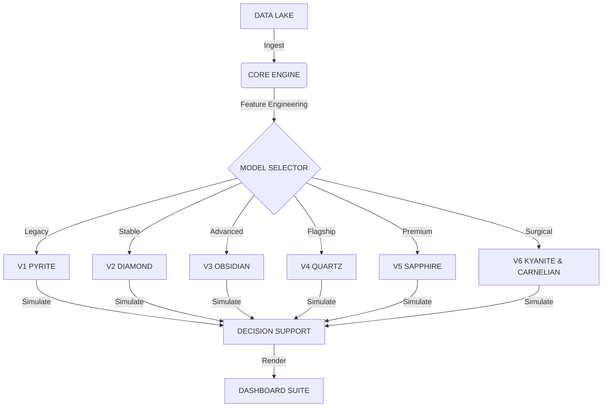

   
  <h1>QUARRY INTELLIGENCE</h1>
  
INSTITUTIONAL ALGORITHMIC ANALYTICS

   

  
  
  
  

   
   
  <a href="https://ducky705.github.io/Quarry-Intelligence/web/selector.html"><strong>ACCESS CONTROL CENTER</strong></a>
   
   

---

## ⚡ EXECUTIVE INTELLIGENCE

A multi-generational algorithmic trading system leveraging **Gradient Boosting Decision Trees (XGBoost)** and **Deep Neural Networks** to identify inefficiencies in sports betting markets.

| MODEL ARCHITECTURE | RELEASED | STRATEGY PROFILE | STATUS | VOLUME | TOTAL BETS | ROI |
| :--- | :--- | :--- | :--- | :--- | :--- | :--- |
| **[SERIES 6: KYANITE & CARNELIAN](https://ducky705.github.io/Quarry-Intelligence/web/kyanite_carnelian.html)** | `MAY 16, 2026` | `SURGICAL ALPHA`   Precision/Yield | 💎 **ACTIVE** | Low (~6 bets/day) | **13** | **-29.9%** |
| **[SERIES 5: SAPPHIRE](https://ducky705.github.io/Quarry-Intelligence/web/sapphire.html)** | `MAY 13, 2026` | `CONFORMAL`   Momentum | 🔵 **PREMIUM** | Low (~8 bets/day) | **42** | **-40.1%** |
| **[SERIES 4: QUARTZ](https://ducky705.github.io/Quarry-Intelligence/web/quartz.html)** | `APR 06, 2026` | `INSTITUTIONAL`   Drift Proxy | ⚪ **FLAGSHIP** | None (0 bets/day) | **0** | **+0.0%** |
| **[SERIES 3: OBSIDIAN](https://ducky705.github.io/Quarry-Intelligence/web/obsidian.html)** | `DEC 27, 2025` | `ADVANCED ENSEMBLE`   Non-Linear | 🟣 **ADVANCED** | None (0 bets/day) | **0** | **+0.0%** |
| **[SERIES 2: DIAMOND](https://ducky705.github.io/Quarry-Intelligence/web/diamond.html)** | `NOV 30, 2025` | `PRECISION CORE`   Refined | 🟢 **STABLE** | None (0 bets/day) | **0** | **+0.0%** |
| **[SERIES 1: PYRITE](https://ducky705.github.io/Quarry-Intelligence/web/pyrite.html)** | `NOV 20, 2025` | `LEGACY CORE`   High-Freq | 🟡 **LEGACY** | None (0 bets/day) | **0** | **+0.0%** |

> [!IMPORTANT]
> **ACCESS PROTOCOL**: The primary interface for all models is the [**Model Selector**](https://ducky705.github.io/Quarry-Intelligence/web/selector.html).

---

## 🛰 SYSTEMS OVERVIEW

### V6 KYANITE & CARNELIAN // THE SURGICAL DNA
*The next evolution.* A dual-engine framework balancing high-threshold precision (Kyanite) with maximum Bayesian value (Carnelian).
*   **Mechanism**: Leverages "Surgical DNA" sequencing to isolate institutional-grade win thresholds and high-edge underdog windows.
*   **Performance**: Optimized for both optical consistency and pure mathematical alpha.

### V5 SAPPHIRE // THE CONFORMAL ENGINE
*The definitive shift.* Employs **Split Conformal Prediction** and **Dynamic Momentum** to bound risk and capture institutional-grade win thresholds.
*   **Mechanism**: Asymmetric loss optimization with drift-aware feature engineering.
*   **Performance**: Targeting maximum precision and high-fidelity alpha.

### V4 QUARTZ // THE PRISM
*The flagship standard.* Utilizes **Correct Shift** logic to identify opening line inefficiencies.

---

## 📚 KNOWLEDGE BASE

### 🔬 DEEP INTELLIGENCE REPORTS
Comprehensive technical audits and strategy profiles for the current model lineup.

*   **[SERIES 6: KYANITE & CARNELIAN Audit](docs/reports/KYANITE_REPORT.md)** - Surgical Alpha, Precision & Liquidity Optimization
*   **[SERIES 5: SAPPHIRE Audit](docs/reports/SAPPHIRE_REPORT.md)** - Conformal Prediction & Momentum
*   **[SERIES 4: QUARTZ Audit](docs/reports/QUARTZ_REPORT.md)** - Institutional Drift Proxy
*   **[SERIES 3: OBSIDIAN Audit](docs/reports/OBSIDIAN_REPORT.md)** - Advanced Non-Linear Ensembles
*   **[SERIES 2: DIAMOND Audit](docs/reports/DIAMOND_REPORT.md)** - Precision Core & Refined Filtering
*   **[SERIES 1: PYRITE Audit](docs/reports/PYRITE_REPORT.md)** - Legacy High-Frequency Core

### 🏛️ LEGACY ARCHIVES
Historical research, methodology versions, and experimental results.

*   **[Deep Mining Report](docs/archive/DEEP_MINING_REPORT.md)** - Foundational research on market inefficiencies.
*   **[Momentum Physics](docs/archive/MOMENTUM_PHYSICS.md)** - Theoretical basis for V5 velocity engines.
*   **[Quantum Results](docs/archive/QUANTUM_RESULTS.md)** - Experimental V4 quantum-enhanced backtests.
*   **[Stress Test Results](docs/archive/STRESS_TEST_RESULTS.md)** - Robustness analysis under extreme market drift.
*   **[Methodology V2](docs/archive/methodology_v2.md)** | **[Methodology V1](docs/archive/methodology_v1.md)**

---

## 🛠 ARCHITECTURE

---

    
<em>© 2026 QUARRY INTELLIGENCE GROUP // PROPRIETARY RESEARCH</em>

