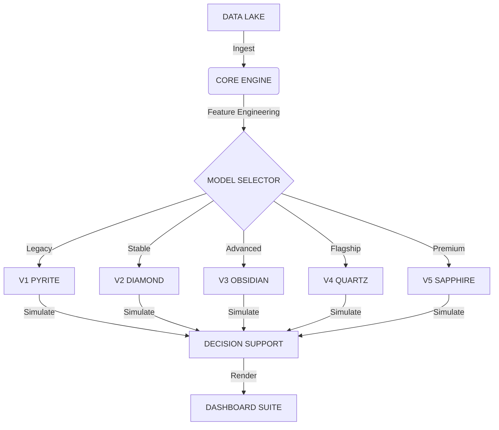

   
  <h1>QUARRY INTELLIGENCE</h1>
  
INSTITUTIONAL ALGORITHMIC ANALYTICS

   

  
  
  
  

   
   
  <a href="https://ducky705.github.io/Quarry Intelligence-Intelligence/selector.html"><strong>ACCESS CONTROL CENTER</strong></a>
   
   

---

## ⚡ EXECUTIVE INTELLIGENCE

A multi-generational algorithmic trading system leveraging **Gradient Boosting Decision Trees (XGBoost)** and **Deep Neural Networks** to identify inefficiencies in sports betting markets.

| MODEL ARCHITECTURE | RELEASED | STRATEGY PROFILE | STATUS | VOLUME | TOTAL BETS | ROI |
| :--- | :--- | :--- | :--- | :--- | :--- | :--- |
| **[SERIES 7: KYANITE](https://ducky705.github.io/Quarry Intelligence-Intelligence/Quarry Intelligence_comparison.html)** | `MAY 15, 2026` | `ABSOLUTE ALPHA`   Precision | 🔥 **NEW** | None (0 bets/day) | **0** | **+0.0%** |
| **[SERIES 7: CARNELIAN](https://ducky705.github.io/Quarry Intelligence-Intelligence/Quarry Intelligence_comparison.html)** | `MAY 15, 2026` | `CAPACITY`   Liquidity | 🔥 **NEW** | Low (~8 bets/day) | **8** | **+7.1%** |
| **[SERIES 1: PYRITE](https://ducky705.github.io/Quarry Intelligence-Intelligence/pyrite.html)** | `NOV 20, 2025` | `LEGACY CORE`   High-Freq | 🟡 **LEGACY** | None (0 bets/day) | **0** | **+0.0%** |
| **[SERIES 2: DIAMOND](https://ducky705.github.io/Quarry Intelligence-Intelligence/diamond.html)** | `NOV 30, 2025` | `PRECISION CORE`   Refined | 🟢 **STABLE** | None (0 bets/day) | **0** | **+0.0%** |
| **[SERIES 3: OBSIDIAN](https://ducky705.github.io/Quarry Intelligence-Intelligence/obsidian.html)** | `DEC 27, 2025` | `ADVANCED ENSEMBLE`   Non-Linear | 🟣 **ADVANCED** | None (0 bets/day) | **0** | **+0.0%** |
| **[SERIES 4: QUARTZ](https://ducky705.github.io/Quarry Intelligence-Intelligence/quartz.html)** | `APR 06, 2026` | `INSTITUTIONAL`   Drift Proxy | ⚪ **FLAGSHIP** | None (0 bets/day) | **0** | **+0.0%** |
| **[SERIES 5: SAPPHIRE](https://ducky705.github.io/Quarry Intelligence-Intelligence/sapphire.html)** | `MAY 13, 2026` | `CONFORMAL`   Momentum | 🔵 **PREMIUM** | Low (~9 bets/day) | **29** | **-41.7%** |

> [!IMPORTANT]
> **ACCESS PROTOCOL**: The primary interface for all models is the [**Model Selector**](https://ducky705.github.io/Quarry Intelligence-Intelligence/selector.html).

---

## 🛰 SYSTEMS OVERVIEW

### V5 SAPPHIRE // THE CONFORMAL ENGINE
*The definitive shift.* Employs **Split Conformal Prediction** and **Dynamic Momentum** to bound risk and capture institutional-grade win thresholds.
*   **Mechanism**: Asymmetric loss optimization with drift-aware feature engineering.
*   **Performance**: Targeting maximum precision and high-fidelity alpha.

### V4 QUARTZ // THE PRISM
*The flagship standard.* Utilizes **Correct Shift** logic to identify opening line inefficiencies.

---

## 🛠 ARCHITECTURE

---

    
<em>© 2026 QUARRY INTELLIGENCE GROUP // PROPRIETARY RESEARCH</em>

