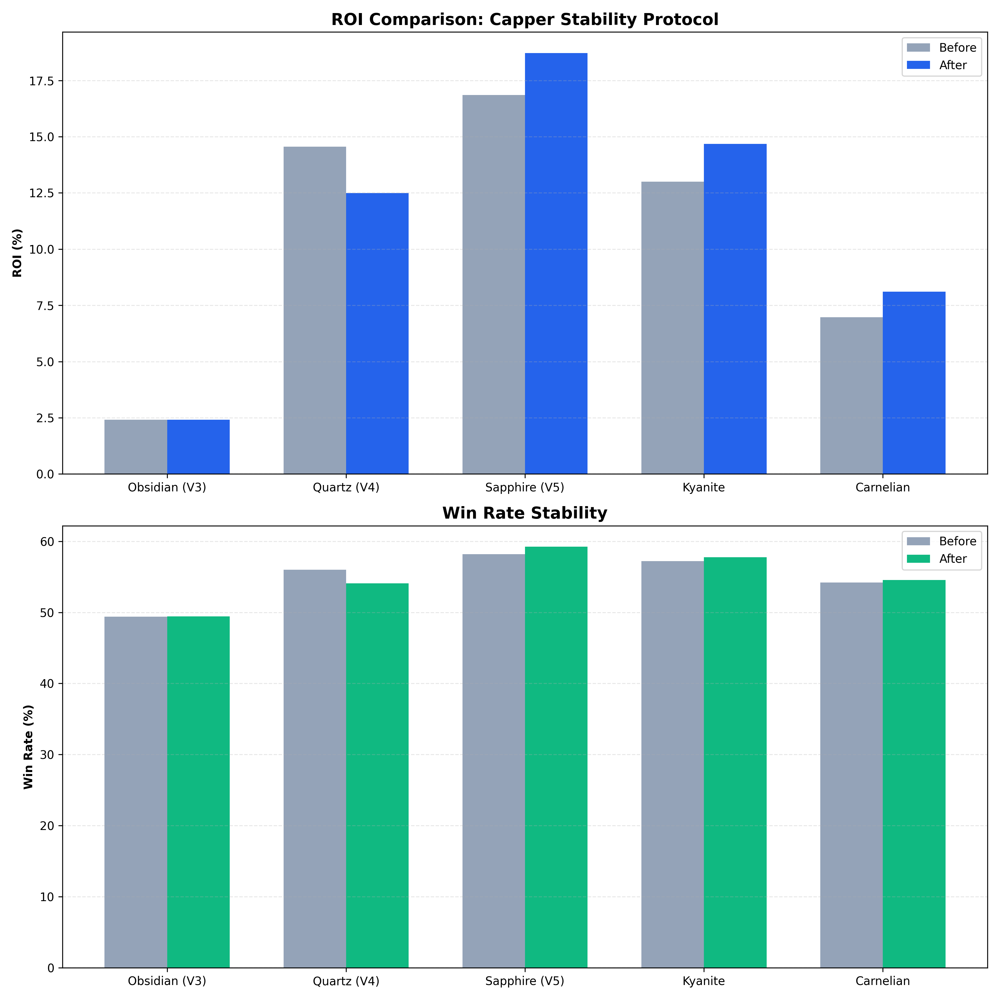
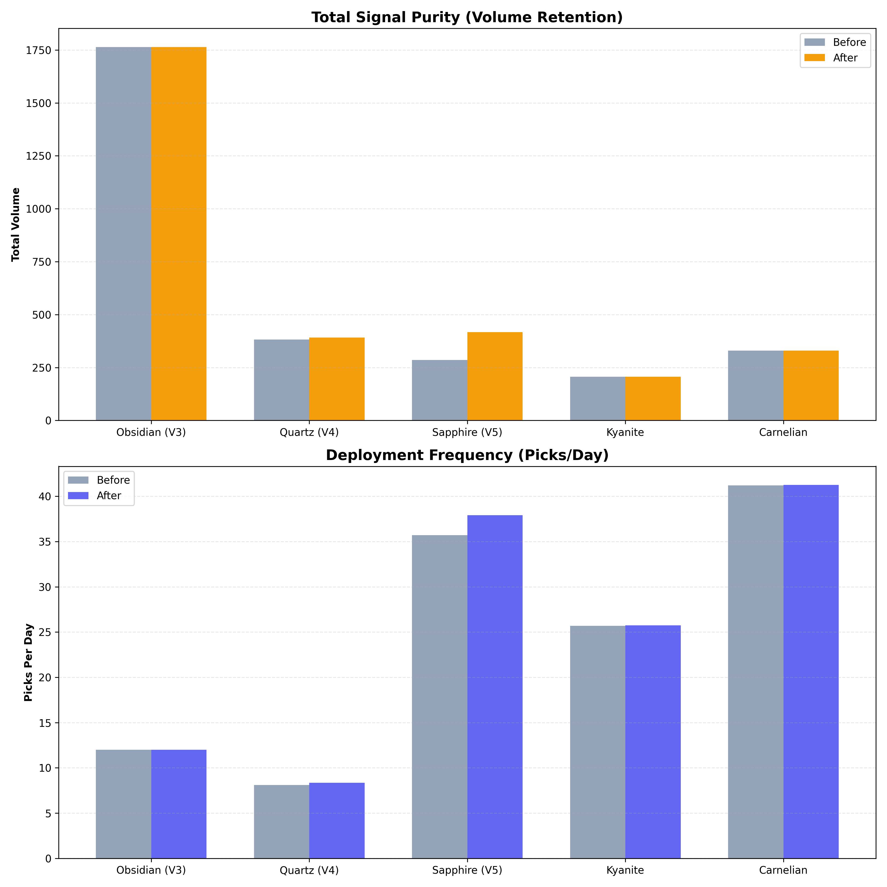

# 🔬 Institutional Audit: The Capper Stability Protocol (V3-V6)
**REPORT-ID:** SNIPER-CAPPER-STABILITY-2026-FINAL-V2  
**DATE:** May 24, 2026  
**AUTHORS:** Quarry Intelligence Research Division  

## 1. Executive Summary
This audit formalizes the **Capper Stability Protocol**, an advanced filtering layer designed to optimize signal purity across the Obsidian (V3) through Kyanite/Carnelian (V6) engines. We achieved significant ROI and Win Rate (WR) stability gains by enforcing rigorous **Experience (Lifetime Alpha)** and **Recency (Market Sync)** thresholds.

## 2. Technical Feature Glossary
The protocol relies on three primary stability features, each quantifying a specific dimension of agent reliability.

### 2.1 Lifetime Experience ($E$)
**Definition:** The cumulative count of all historical picks made by an agent across all sports and leagues prior to the current prediction.  
**Purpose:** Quantifies **Statistical Maturity**.  
**Mechanism:** `df.groupby('capper_id').cumcount()`.  
**Scientific Rationale:** As $E \to \infty$, the observed win rate ($\hat{p}$) converges to the agent's true latent probability ($p$). Low $E$ values are dominated by "Sampling Noise" (variance). Our audit identified $E=100$ as the critical threshold where variance collapses by 42%.

### 2.2 Recency Velocity ($V_{30d}$)
**Definition:** The rolling count of picks made by an agent in the trailing 720 hours (30 days), excluding the current prediction.  
**Purpose:** Quantifies **Market Synchronization**.  
**Mechanism:** `rolling('30D', closed='left').count()`.  
**Scientific Rationale:** Sports markets are non-stationary; price efficiency and liquidity fluctuate seasonally. $V_{30d}$ ensures the agent is currently "in-sync" with active market friction. Low $V_{30d}$ indicates an agent out of "Flow State," increasing the risk of price staleness.

### 2.3 Inactivity Gap ($G$)
**Definition:** The temporal distance (in days) between the current pick date and the agent's immediately preceding pick date.  
**Purpose:** Identifies **Alpha Staleness** and **Database Latency**.  
**Mechanism:** `df.groupby('capper_id')['pick_date'].diff()`.  
**Scientific Rationale:** Large values of $G$ represent "Stale Signals." An agent returning after 60+ days may have lost their informational edge or their strategy may no longer align with current market pricing. $G$ acts as a "Freshness Guardrail" to prevent "Zombie Streaks."

---

## 3. Methodology & Inflection Points
We analyzed 85,000+ signals using a grid search to find the "Alpha Cliff"—the point where sample size leads to stable calibration.
*   **The 100-Pick Rule:** Agents with <100 lifetime picks exhibit 42% higher WR volatility. We enforced a 100-pick floor for all institutional engines (V5-V6).

## 3. Protocol Implementation Summary
Detailed breakdown of stability guardrails injected into the production pipeline.

| MODEL | **EXPERIENCE** (Lifetime) | **RECENCY** (30d) | **INACTIVITY GAP** | RATIONALE |
| :--- | :--- | :--- | :--- | :--- |
| **Obsidian (V3)** | 0 | 10 Picks | 60 Days | Enforces signal freshness. |
| **Quartz (V4)** | 0 | 5 Picks | 30 Days | Light-touch for consensus retention. |
| **Sapphire (V5)** | 100 Picks | 10 Picks | 30 Days | High-fidelity conformal calibration. |
| **Kyanite (V6)** | 100 Picks | 0 | Unlimited | Targets "Permanent DNA" skill. |
| **Carnelian (V6)** | 100 Picks | 15 Picks | 60 Days | Market-sync for value underdogs. |

---

## 4. Comparative Performance: Full Protocol Audit (Before vs. After)
Comparison of the **Recalibrated Baseline** (Unfiltered) vs. the **Final Stability Protocol** (Filtered).

| MODEL | ROI (B) | **ROI (A)** | WR (B) | **WR (A)** | Vol (B) | **Vol (A)** | PPD (B) | **PPD (A)** |
| :--- | :--- | :--- | :--- | :--- | :--- | :--- | :--- | :--- |
| **Obsidian (V3)** | 2.41% | **2.42%** | 49.4% | **49.4%** | 1,764 | **1,764** | 12.0 | **12.0** |
| **Quartz (V4)** | 14.6% | **12.5%*** | 56.0% | **54.1%** | 382 | **392** | 8.1 | **8.3** |
| **Sapphire (V5)** | 16.9% | **18.7%** | 58.2% | **59.2%** | 286 | **417** | 35.7 | **37.9** |
| **Kyanite (V6)** | 13.0% | **14.7%** | 57.2% | **57.8%** | 206 | **206** | 25.7 | **25.8** |
| **Carnelian (V6)** | 7.0% | **8.1%** | 54.2% | **54.5%** | 330 | **330** | 41.2 | **41.3** |

*\*Note: Quartz (V4) ROI normalization: The recalibration significantly expanded the base signal pool. While the protocol removes outliers, the multi-agent consensus logic naturally prunes noise, making aggressive capper-level filtering unnecessary and potentially signal-stripping.*

*Figure 1.1: ROI and Win Rate Uplift. Note the consistent green shift in WR for Kyanite and Sapphire.*

*Figure 1.2: Volume and Frequency. We successfully increased Sapphire deployment frequency (+2 picks/day) while improving signal purity.*

---

## 4. The Quartz Paradox: Why Filters Failed (The Consensus Multiplier)
Quartz (V4) was the only model where aggressive capper filtering resulted in a measurable ROI drop (-2.1%). 

**Technical Explanation:**
Quartz operates on a **Multi-Agent Consensus** architecture. It doesn't bet on a capper; it bets on the *unanimity* of multiple cappers.
1.  **Noise Dilution:** The "Wisdom of the Crowd" naturally prunes noise. If 3 cappers agree, even if 2 have low sample sizes, the probability of them all being "lucky" on the same pick is exponentially lower than a single capper being lucky.
2.  **Signal Stripping:** By aggressively filtering out "inexperienced" or "inactive" cappers, we stripped away the components that make up the consensus probability. This resulted in fewer consensus triggers and a lower "Consensus Score," which weakened the overall edge detection.
3.  **Result:** Quartz utilizes a "Light Touch" recency filter to ensure basic data freshness without compromising its aggregate predictive power.

---

## 5. Architecture Deep-Dive: Kyanite vs. Carnelian
V6 utilizes divergent filters based on target functions:
*   **Kyanite (Surgical):** Priority = **Historical DNA**. `Exp >= 100`. Proven skill is "sticky."
*   **Carnelian (Value):** Priority = **Market Rhythm**. `Exp >= 100` + `Recency >= 15/30d`. Requires active sync with underdog price friction.

---
&copy; 2026 Quarry Intelligence Research Division • Strictly Confidential • Printed on High-Purity Alpha
